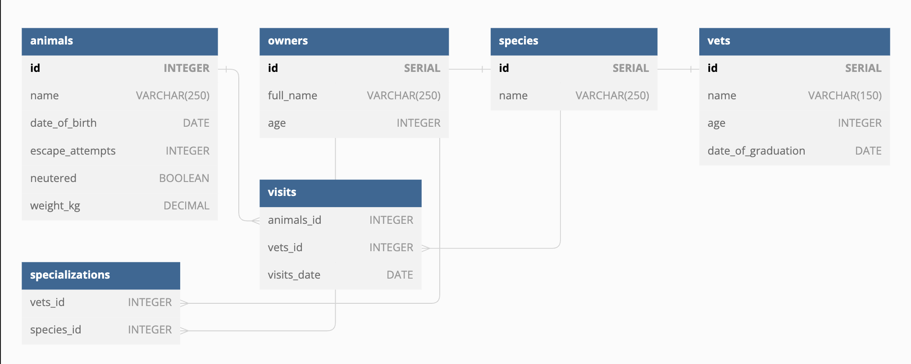

# Vet-clinic_database

> This repository contains a relational database project for a vet clinic. The project is part of the curriculum at Microverse. The repository includes plain SQL files that can be used to recreate the database.

## Getting Started

This repository includes files with plain SQL that can be used to recreate a database:

- Use [schema.sql](./schema.sql) to create all tables.
- Use [data.sql](./data.sql) to populate tables with sample data.
- Check [queries.sql](./queries.sql) for examples of queries that can be run on a newly created database. Important note: this file might include queries that make changes in the database (e.g., remove records). Use them responsibly!

- Take a look at the following database diagram for the vet-clinic:
     -   

<a name="readme-top"></a>

 <!-- TABLE OF CONTENTS -->

# 📗 Table of Contents

- [📖 About the Project](#about-project)
  - [🛠 Built With](#built-with)
- [💻 Getting Started](#getting-started)
  - [Setup](#setup)
  - [Prerequisites](#prerequisites)
  - [Run tests](#run-tests)
- [👥 Authors](#authors)
- [🔭 Future Features](#future-features)
- [🤝 Contributing](#contributing)
- [⭐️ Show your support](#support)
- [🙏 Acknowledgements](#acknowledgements)
- [📝 License](#license)

 <!-- PROJECT DESCRIPTION -->

# 📖 Create the database clinic based on diagram <a name="about-project"></a>

- This project about converting the schema diagram into the sql commands using the postgresql, contains table for the patients and treatments etc....

## 🛠 Built With <a name="built-with"></a>

- Sql commands
- Postgresql
- schema diagram

 <p align="right">(<a href="#readme-top">back to top</a>)</p>
 
 ## Key Features
 
 - Schema based on diagram😊👌
 - OPtimization the foreign key with indexing💯
 - Use the many to many relationship🚀
 
 <!-- GETTING STARTED -->
 
<!-- GETTING STARTED -->

## 💻 Getting Started <a name="getting-started"></a>

To get a local copy up and running, follow these steps.

### Prerequisites

In order to run this project you need:


Example command:

```sh
1.use a browser
2.use cable internet
```

### Setup

Clone this repository to your desired folder:


Example commands:

```sh
  
  git clone git@github.com:Ouail-01/Vet-clinic_database.git
  cd Vet-clinic_database


```

### Install

Install this project with:

Example command:

```sh
bundle install
```

### Usage

To run the project, execute the following command:


Example command:

```sh
- Open the terminal to play with the commands.
```

### Run tests

To run tests for the linter, run the following command:


Example command:

```sh
rubocop -A
```

 <p align="right">(<a href="#readme-top">back to top</a>)</p>
 
 ## 👥 Authors <a name="authors"></a>
 
 👤 **Ouail Laarabi**
 
 - GitHub: [Click here](https://github.com/Ouail-01?tab=overview&from=2023-01-01&to=2023-01-02)
 - Twitter: [Click here](https://twitter.com/Ouail_Laarabi)
 - LinkedIn: [Click here](https://www.linkedin.com/in/ouail-laarabi-53203b250/)
 
 👤 **Prince**
 
 - GitHub: [@prius2055](https://github.com/prius2055)
 - Twitter: [@prius2055](https://www.twitter.com/prius2055)
 - LinkedIn: [@prius2055](https://www.linkedin.com/prius2055)

👤 **Damilare**

- GitHub: [@githubhandle](https://github.com/bestbynature)
- Twitter: [@twitterhandle](https://twitter.com/Dammybest)
- LinkedIn: [LinkedIn](https://linkedin.com/in/damilareismailabestbynature/)
 
 <p align="right">(<a href="#readme-top">back to top</a>)</p>
 
 <!-- FUTURE FEATURES -->
 
 ## 🔭 Future Features <a name="future-features"></a>
 
 - [ ] Enhance the sql commands using query plan.
 - [ ] Add more tables💯.
 - [ ] Add other relationships to the tables..
 
 <p align="right">(<a href="#readme-top">back to top</a>)</p>
 
 <!-- CONTRIBUTING -->
 
 ## 🤝 Contributing <a name="contributing"></a>
 
 Contributions, issues, and feature requests are welcome!
 
 Feel free to check the [Isuues Pages](https://github.com/Ouail-01/Vet-clinic_database/issues)
 
 
 <p align="right">(<a href="#readme-top">back to top</a>)</p>
 
 <!-- SUPPORT -->
 
 ## ⭐️ Show your support <a name="support"></a>
 
 
 If you like this project kindly give it a star⭐️.
 
 <p align="right">(<a href="#readme-top">back to top</a>)</p>
 
 <!-- ACKNOWLEDGEMENTS -->
 
 ## 🙏 Acknowledgments <a name="acknowledgements"></a>
 
 
 I would like to thank Ekpenisi E Raphael for the immense support.
 
 <p align="right">(<a href="#readme-top">back to top</a>)</p>
 
 
 <!-- LICENSE -->
 
 ## 📝 License <a name="license"></a>
 
 This project is [MIT](https://github.com/Ouail-01/Vet-clinic_database/blob/dev/LICENSE) licensed.
  
 <p align="right">(<a href="#readme-top">back to top</a>)</p>
